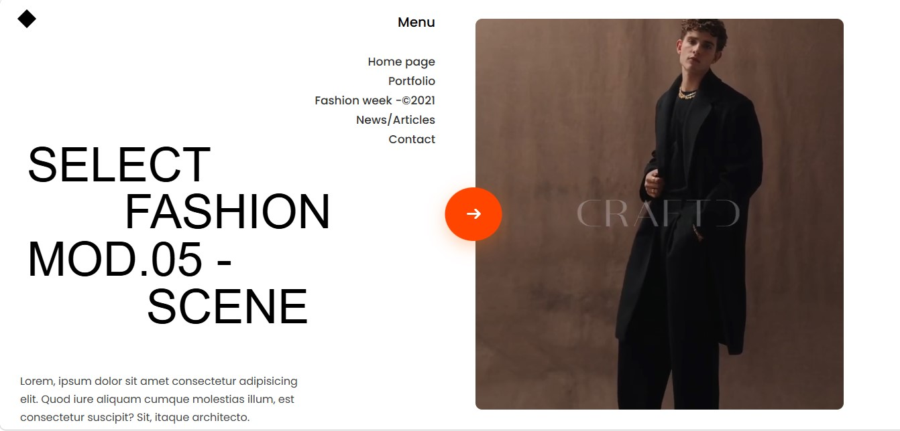
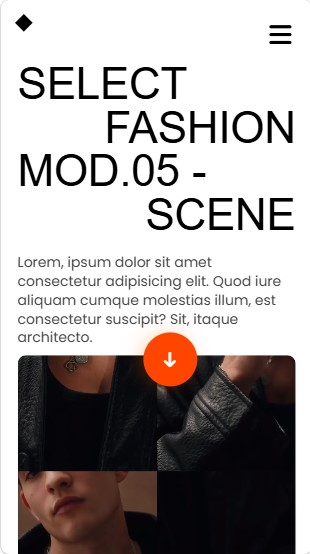
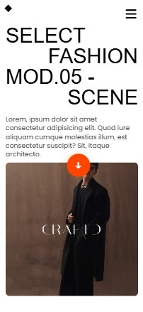

# Fashion Grid Layout

This is a modern fashion-inspired responsive grid layout built using HTML and CSS.  
The project focuses on clean typography, CSS Grid layout structure, responsive design, smooth hover interactions and modern UI aesthetics.

## Features

- Fully responsive layout
- CSS Grid based structure
- Interactive floating arrow button
- Smooth hover animations
- Video showcase section
- Modern typography inspired design
- Mobile responsive layout
- Clean and minimal UI design
- Subtle video zoom hover effect

## Technologies Used

- HTML5
- CSS3
- CSS Grid
- Flexbox
- Font Awesome
- Google Fonts
- Git & GitHub

## Folder Structure

```bash
fashion-grid-layout/
│
├── assets/
│   ├── images/
│   │   ├── desktop-preview.jpg
│   │   ├── mobile-preview.jpg
│   │   └── mobile-full-layout.jpg
│   │
│   └── videos/
│       └── video.mp4
│
├── index.html
├── style.css
└── README.md
```

## Screenshots

### Desktop Preview



### Mobile Preview



### Mobile Full Layout



## Demo Video

[Watch Demo Video](https://drive.google.com/file/d/1PFbkBskiJDXu4VEi2nt9rYWyRSlh2tx6/view?usp=drive_link)

## How to Run

### 1. Clone the repository

```bash
git clone https://github.com/kenil948/fashion-grid-layout.git
```

### 2. Open the project

Open `index.html` in your browser.

## Live Demo

Check it out here:

https://kenil948.github.io/fashion-grid-layout/

## What I Learned

- CSS Grid layouts
- Responsive web design
- Layout balancing and spacing
- Positioning using absolute and relative
- Hover interaction effects
- Video handling in layouts
- Mobile responsiveness improvements
- UI/UX design fundamentals
- Better GitHub project structuring

## Notes

This is a frontend practice project created for improving responsive layout design and modern UI development skills.

Inspired by modern fashion and editorial style landing pages.
